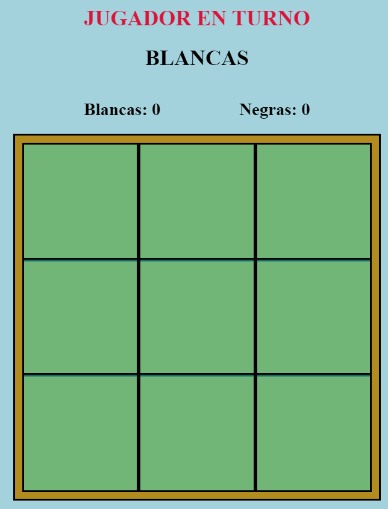

# Juegos de mesa virtuales

Este repositorio tiene como propósito ofrecer un catálogo de varios juegos de mesa virtuales. Siéntete libre de explorar y disfrutar de estos juegos en línea.

## Lista de juegos

1. **Tres en raya**
    - **Descripción:** El clásico juego de Tres en raya, también conocido como Tic-Tac-Toe, es un divertido pasatiempo para dos jugadores. ¡Demuestra tu estrategia y destreza!
    - **Imagen:**  

    [¡Juega ahora!](https://fabo2303.github.io/fabiancito_games_xd/tresEnRaya.html)

Si tienes alguna sugerencia sobre algún juego que pueda agregar, no dudes en enviármela. ¡Estoy dispuesto a escuchar tus ideas!